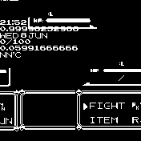

# Pokemon Battle

This watch face will display the date, time, bluetooth connection status, and battery percentage over a pokemon battle.

## Usage

Download this app to your watch and follow Settings -> System -> Select Clock -> PkMn Btl. The watch face should now be set to Pokemon Battle.

## Features

Tried and true overview including:
- Date
- Time
- Bluetooth connection status
- Battery Percentage

## Requests

For requests or bug reports please [submit an issue](https://github.com/splch/pokebtl/issues/new) on the GitHub page.

## Creator

Spencer Churchill

## Attributions

All icons used in this app are from [icons8](icons8.com).
